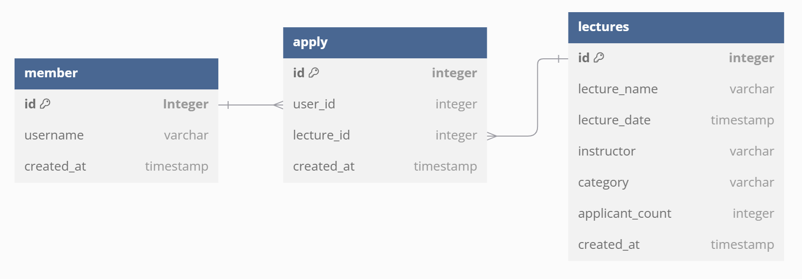

# 요구사항
1. POST /lectures/{lectureId}/users/{userId}
2. GET /lectures?date={date} (해당 날짜에 신청 가능한 특강 목록 조회)
3. GET /lectures/completion/users/{userId} 
4. 동일한 신청자는 동일한 강의에 대해서 한번의 수강 신청만 성공
5. userId로 선착순 30명만 신청
6. 신청자가 30명이 초과되면 이후 신청자는 요청을 실패 (DB 동시 접근 시 동시성 제어)

## 요구사항 분석 (실패 케이스)
- [x] 현재보다 과거의 날짜는 신청할 수 없다(400).
- [x] 동일한 신청자가 동일한 강의를 5번 수강 신청할 경우 4번의 요청이 실패(400)되어야한다.
- [x] 존재하지 않는 userId / lectureId 일 경우 요청이 실패(400)되어야한다.
- [x] 신청한 특강 목록이 없을 경우 요청이 실패(204)되어야한다. 
- [x] 목록 조회시 이미 정원이 꽉 찬 특강을 반환하지 않아야한다. 
- [x] 목록 조회시 해당 날짜에 lecture가 없을 경우 요청이 실패(204)되어야한다.  

### STEP3
- [x] 동시에 동일한 특강에 대해 서로 다른 사용자 40명이 신청되었을 때 30명만 성공한다.

### STEP 4
- [x] 동일한 신청자가 동일한 강의를 5번 수강 신청할 경우 1번의 요청만 성공한다.

# 사용자 시나리오
페르소나: 역량향상을 원하는 유저 or 이직을 원하는 유저

# 고민사항
1. 동일한 신청자 (userId가 같은 신청자)
2. 동일한 강의 (lectureId가 같은 강의)
3. 한번의 수강 신청 (userId별 lectureId)
4. 선착순 (요청을 받는 순)
5. 동시성 이슈
   1) 서로 다른 사용자가 동시 신청시 DB의 강의 테이블의 신청자 수 ROW가 충돌
   2) 동일한 사용자가 빠르게 여러 번 신청할 경우 DB의 신청 테이블 userId에 대한 lectureId이 갱신되기 전에 조회함으로써 ROW가 충돌

# ERD

### 이유
ERD를 작성할 때 3가지 경우의 수를 생각해보았습니다.
1. users 테이블에 신청한 lectue_id 컬럼을 추가한다고 가정 -> 한 사용자가 여러 강의를 신청할 수 있다 -> user_id가 중복된 row가 발생 -> primary key의 제약조건을 만족하지 못한다.
2. lectures 테이블에 신청한 user_id 컬럼을 추가한다고 가정 -> 한 강의가 여러 사용자를 수용할 수 있다 -> lecture_id가 중복된 row가 발생 -> primary key의 제약조건을 만족하지 못한다.
3. users, lectures와 분리된 조인 테이블(apply)을 추가한다고 가정 -> 중복된 user_id와 lecture_id를 가질 수 있음
### 1, 2의 경우 모순이 발생하므로 3번의 방법을 사용해서 ERD를 설계하였습니다.